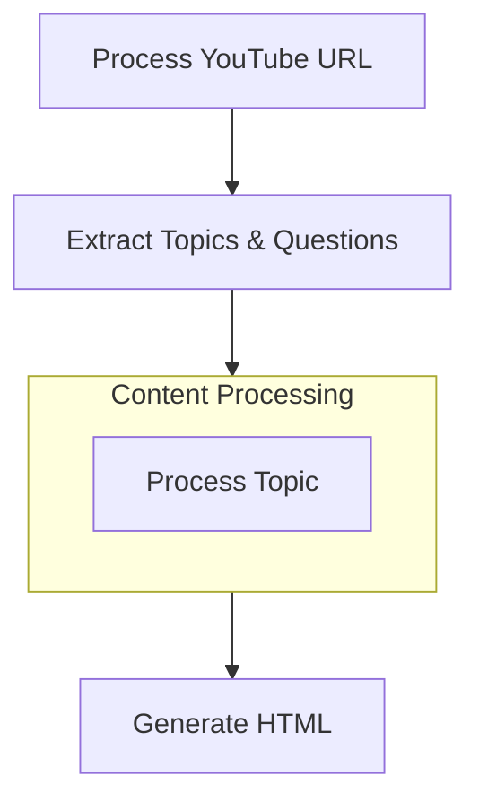

# Explain Youtube Podcast To Me Like I'm 5

## Project Requirements
This project takes a YouTube podcast URL, extracts the transcript, identifies key topics and Q&A pairs, simplifies them for children, and generates an HTML report with the results.

## Utility Functions

1. **LLM Calls** (`utils/call_llm.py`)

2. **YouTube Processing** (`utils/youtube_processor.py`)
   - Get video title, transcript and thumbnail

3. **HTML Generator** (`utils/html_generator.py`)
   - Create formatted report with topics, Q&As and simple explanations

## Flow Design

The application flow consists of several key steps organized in a directed graph:

1. **Video Processing**: Extract transcript and metadata from YouTube URL
2. **Topic Extraction**: Identify the most interesting topics (max 5)
3. **Question Generation**: For each topic, generate interesting questions (3 per topic)
4. **Topic Processing**: Batch process each topic to:
   - Rephrase the topic title for clarity
   - Rephrase the questions
   - Generate ELI5 answers
5. **HTML Generation**: Create final HTML output

### Flow Diagram



## Data Structure

The shared memory structure will be organized as follows:

```python
shared = {
    "video_info": {
        "url": str,            # YouTube URL
        "title": str,          # Video title
        "transcript": str,     # Full transcript
        "thumbnail_url": str,  # Thumbnail image URL
        "video_id": str        # YouTube video ID
    },
    "topics": [
        {
            "title": str,              # Original topic title
            "rephrased_title": str,    # Clarified topic title
            "questions": [
                {
                    "original": str,      # Original question
                    "rephrased": str,     # Clarified question
                    "answer": str         # ELI5 answer
                },
                # ... more questions
            ]
        },
        # ... more topics
    ],
    "html_output": str  # Final HTML content
}
```

## Node Designs

### 1. ProcessYouTubeURL
- **Purpose**: Process YouTube URL to extract video information
- **Design**: Regular Node (no batch/async)
- **Data Access**: 
  - Read: URL from shared store
  - Write: Video information to shared store

### 2. ExtractTopicsAndQuestions
- **Purpose**: Extract interesting topics from transcript and generate questions for each topic
- **Design**: Regular Node (no batch/async)
- **Data Access**:
  - Read: Transcript from shared store
  - Write: Topics with questions to shared store
- **Implementation Details**:
  - First extracts up to 5 interesting topics from the transcript
  - For each topic, immediately generates 3 relevant questions
  - Returns a combined structure with topics and their associated questions

### 3. ProcessTopic
- **Purpose**: Batch process each topic for rephrasing and answering
- **Design**: BatchNode (process each topic)
- **Data Access**:
  - Read: Topics and questions from shared store
  - Write: Rephrased content and answers to shared store

### 4. GenerateHTML
- **Purpose**: Create final HTML output
- **Design**: Regular Node (no batch/async)
- **Data Access**:
  - Read: Processed content from shared store
  - Write: HTML output to shared store

